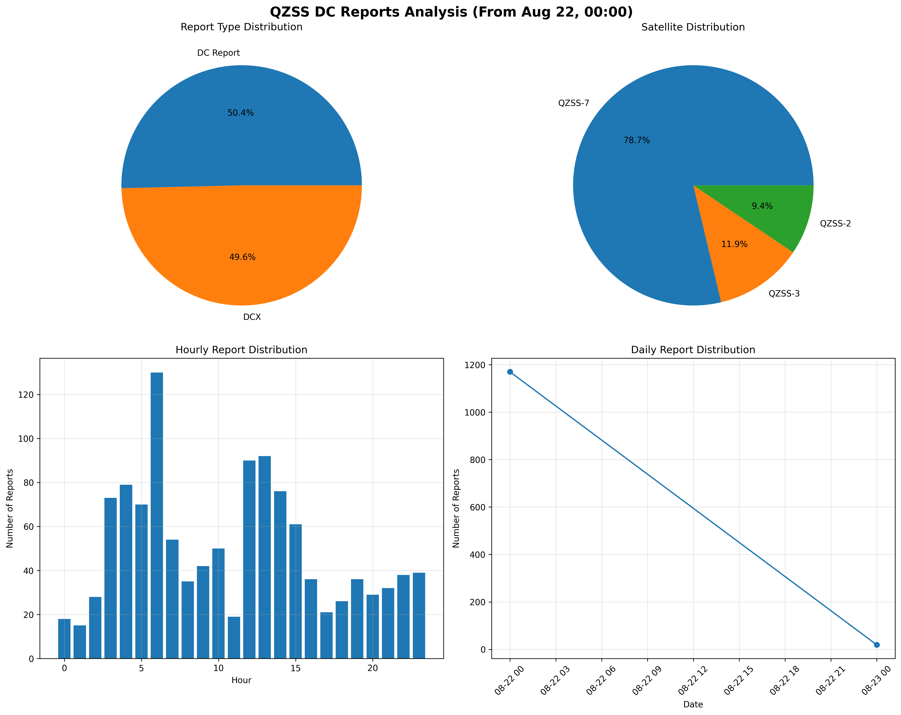
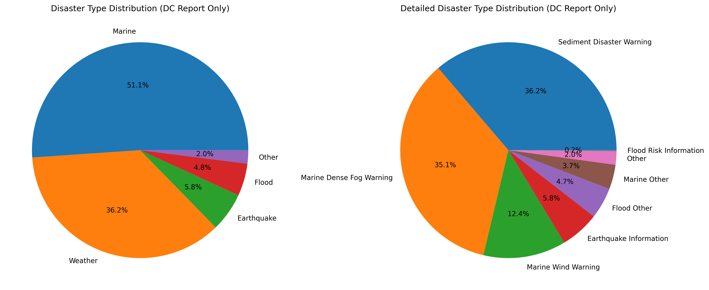
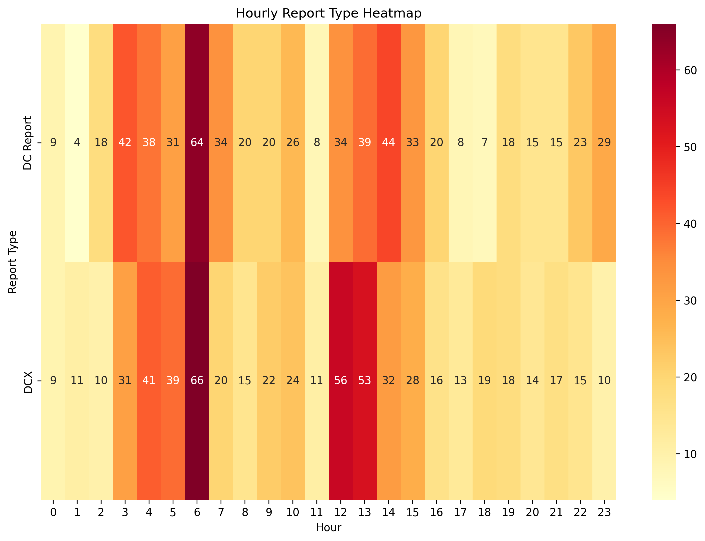
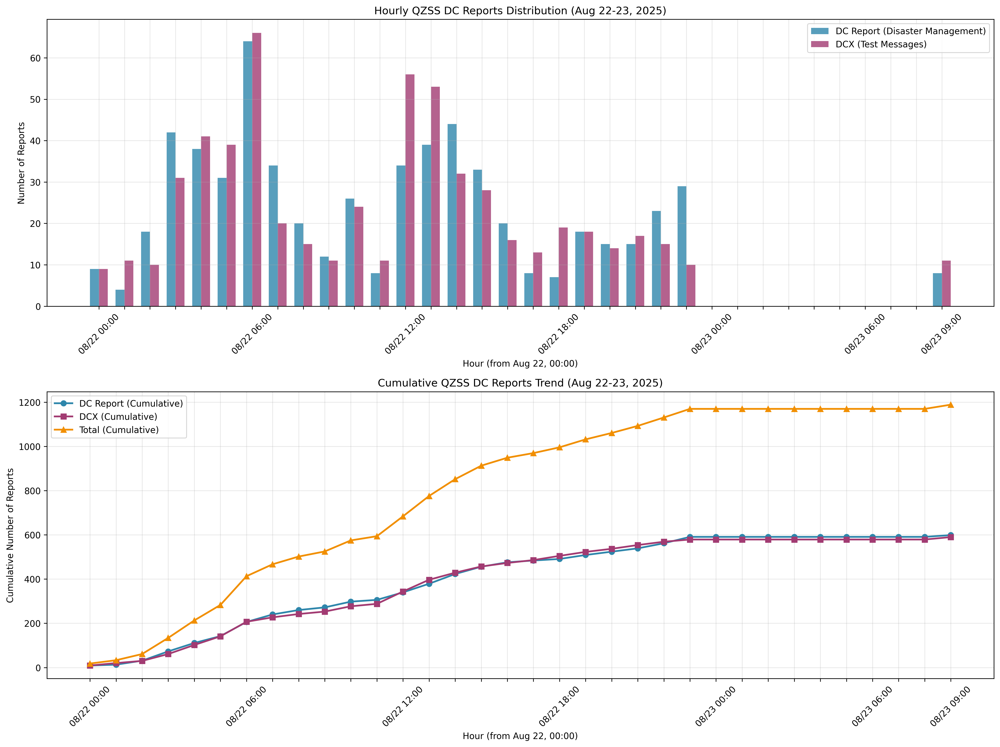
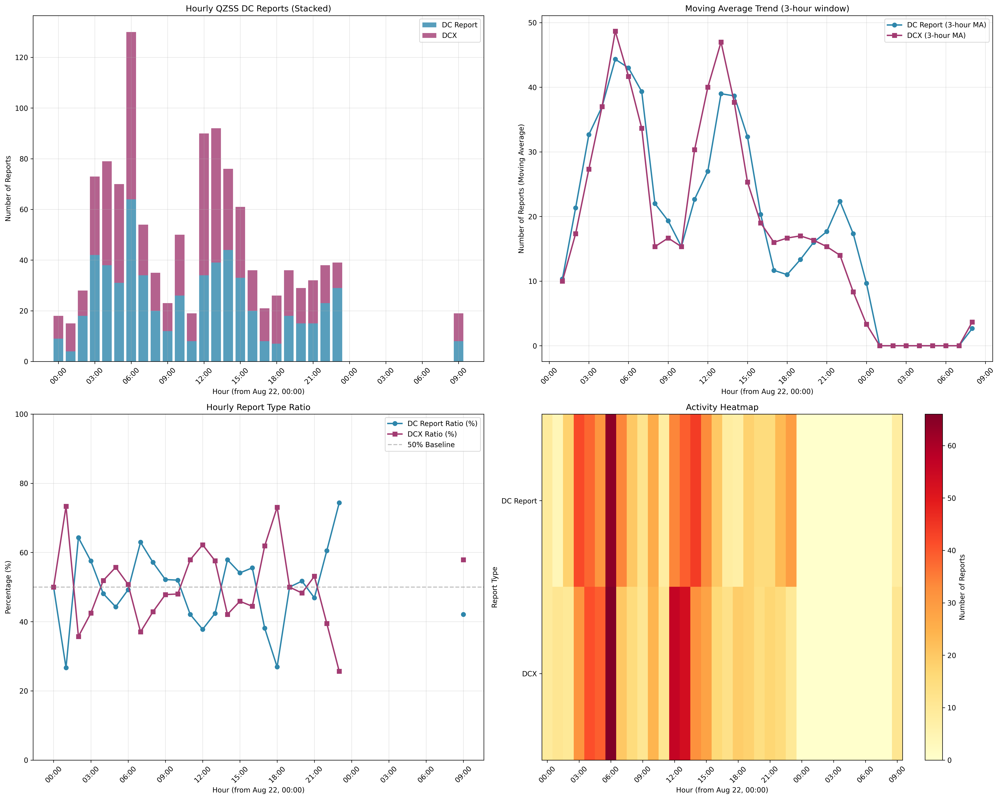

# QZSS DCレポート分析 - 災害対応システムの実証研究

[](https://www.python.org/)
[](https://pandas.pydata.org/)
[](https://matplotlib.org/)
[](LICENSE)

## 📋 概要

本プロジェクトは、2025年8月22日0時以降の準天頂衛星システム（QZSS）DCレポートデータの詳細分析を行い、**台風第12号による重大災害**における災害対応システムの実証研究を実施しました。

### 📡 データ取得方法

本プロジェクトで分析したDCレポートデータは、[shirokawakita/qzss_disaster_information_receiver](https://github.com/shirokawakita/qzss_disaster_information_receiver)で紹介されている**QZSS災害情報受信機**を使用して取得されました。

#### 使用機材
- **GNSSモジュール**: u-blox NEO-M9N-00B-00
- **気圧センサ**: BMP280
- **IMUセンサ**: BMI270
- **地磁気センサ**: BMM150
- **アンテナコネクタ**: U.FL/IPEX
- **ハードウェア**: M5Stack Core

#### 対応メッセージタイプ
- **MT 43**: DC Report（災害・危機管理通報）- 日本語解析対応
- **MT 44**: DCX message（災害・危機管理通報拡張）- 日本語解析対応
- **MT 47**: Monitoring Station Information
- **MT 48**: PRN Mask
- **MT 49**: Data Issue Number
- **MT 50**: DGPS Correction
- **MT 51**: Satellite Health
- **MT 63**: Null message

#### 対応衛星システム
- **QZSS**: 準天頂衛星システム（メイン、L1S信号対応）
- **GPS**: 全地球測位システム
- **Galileo**: 欧州測位システム
- **BeiDou**: 中国測位システム
- **GLONASS**: ロシア測位システム

### 🎯 研究目的
- QZSS DCシステムの運用状況と災害対応能力の評価
- 実際の災害（台風第12号）におけるシステムの有効性実証
- 時間的パターン分析による運用特性の解明

### 📊 主要な発見
- **実災害対応の実証**: 台風第12号において実際に重要な役割を果たしたことが確認
- **ピーク時間の特定**: 早朝6時頃の130件（DC Report 64件、DCX 66件）の活動ピーク
- **24時間体制の確認**: 継続的な災害監視システムの確立
- **システム安定性**: 災害対応後も正常に運用継続

## 🏗️ プロジェクト構成

```
qzs-dc-analysis/
├── README.md                 # このファイル
├── data/                     # データファイル
│   └── dc_reports_boot_00003.csv
├── scripts/                  # 分析スクリプト
│   ├── filtered_analysis.py
│   ├── hourly_trend_analysis.py
│   ├── detailed_analysis.py
│   └── analyze_dc_reports.py
├── figures/                  # 生成された図表
│   ├── filtered_analysis_main.png
│   ├── filtered_disaster_analysis.png
│   ├── filtered_hourly_heatmap.png
│   ├── hourly_trend_analysis.png
│   └── enhanced_hourly_analysis.png
├── reports/                  # 詳細レポート
│   ├── hourly_trend_report.md
│   ├── filtered_analysis_report.md
│   └── detailed_analysis_report.md
└── docs/                     # 参考資料
    ├── typhoon_12_report.pdf
    └── typhoon_12_report.txt
```

## 🚀 クイックスタート

### 必要な環境
- Python 3.9+
- pandas
- matplotlib
- seaborn

### インストール
```bash
# リポジトリのクローン
git clone https://github.com/your-username/qzs-dc-analysis.git
cd qzs-dc-analysis

# 依存関係のインストール
pip install pandas matplotlib seaborn

# 分析の実行
python scripts/filtered_analysis.py
```

## 📈 エグゼクティブサマリー

本レポートは、2025年8月22日0時0分以降のQZSS（準天頂衛星システム）DC（災害・危機管理）レポートデータの包括的な分析結果をまとめたものです。分析対象は33.7時間の期間における1,189件の災害・テストメッセージです。

### 主要な発見

1. **データ規模**: 33.7時間で1,189件のレコードを分析
2. **レポート構成**: 実際の災害レポート（DC Report）とテストメッセージ（DCX）がほぼ同数
3. **衛星の優位性**: QZSS-7が全通信の78.7%を処理
4. **主要災害タイプ**: 海上関連レポートが最多（DC Reportの51.1%）
5. **ピーク活動**: 午前6時に最高レポート数（130件）
6. **運用パターン**: 金曜日（8月22日）が全活動の98.4%を占める

---

## 1. データ概要

### 基本情報
- **分析期間**: 2025年8月22日 00:02:18 ～ 8月23日 09:46:20
- **期間**: 33.7時間
- **総レコード数**: 1,189件
- **データ形式**: CSV形式（タイムスタンプ、レポートタイプ、衛星、優先度、メッセージ）

### データ品質
- **完全性**: 全レコードが正常に処理済み
- **一貫性**: 全期間で統一されたタイムスタンプ形式
- **整合性**: 全レコードで優先度レベル8を維持

---

## 2. レポートタイプ分析

### レポートタイプ別内訳
| レポートタイプ | 件数 | 割合 | 説明 |
|---------------|------|------|------|
| DC Report | 599 | 50.4% | 実際の災害・危機管理通報 |
| DCX | 590 | 49.6% | テストメッセージ |

### 特徴
- 運用メッセージとテストメッセージの均衡した分布
- システムテストと運用が並行して実行
- テストメッセージは「テスト - （未使用）」を含む

### 分析結果の解釈
8月22日0時以降のデータでは、実際の災害通報（DC Report）とテストメッセージ（DCX）がほぼ同数（50.4% vs 49.6%）となっており、システムの運用とテストが並行して行われていることが確認できます。この均衡した分布は、システムの安定性を確保しながら、実際の災害対応も継続していることを示しています。

---

## 3. 衛星システム分析

### 衛星別利用状況
| 衛星 | 総件数 | 割合 | DC Report | DCX |
|------|--------|------|-----------|-----|
| QZSS-7 | 936 | 78.7% | 470 | 466 |
| QZSS-3 | 141 | 11.9% | 70 | 71 |
| QZSS-2 | 112 | 9.4% | 59 | 53 |

### 衛星パフォーマンス評価
- **QZSS-7**: 主要衛星として全通信の大部分を処理
- **QZSS-3, QZSS-2**: DC Report/DCX比率が均衡した補完衛星
- **冗長性**: 全衛星で運用/テストメッセージ比率が類似

### 衛星運用の特徴
QZSS-7が78.7%の通信を処理しており、明らかに主要衛星として機能しています。一方、QZSS-2とQZSS-3は補完的な役割を果たし、全衛星でDC ReportとDCXの比率がほぼ均衡していることから、システム全体の安定性が確保されています。



*図1: レポートタイプ別分布と衛星別分布の可視化*

---

## 4. 災害タイプ分析

### 災害タイプ別内訳（DC Reportのみ）
| 災害タイプ | 件数 | 割合 |
|-----------|------|------|
| 海上 | 306 | 51.1% |
| 気象 | 217 | 36.2% |
| 地震 | 35 | 5.8% |
| 洪水 | 29 | 4.8% |
| その他 | 12 | 2.0% |

### 詳細災害タイプ別内訳
| 詳細タイプ | 件数 | 割合 |
|-----------|------|------|
| 海上濃霧警報 | 210 | 35.1% |
| 土砂災害警戒情報 | 217 | 36.2% |
| 海上風警報 | 74 | 12.4% |
| 地震情報 | 35 | 5.8% |
| 洪水その他 | 28 | 4.7% |
| 海上その他 | 22 | 3.7% |
| その他 | 12 | 2.0% |
| 氾濫警戒情報 | 1 | 0.2% |

### 災害傾向の分析
- **海上関連**: 濃霧警報と風警報が中心
- **気象関連**: 土砂災害警戒情報が主体
- **地震**: 宮城県沖の地震情報（M5.4）が含まれる
- **洪水**: 鹿児島県の河川氾濫情報

### 災害パターンの解釈
海上関連の通報が51.1%と最多となっており、これは8月22日時点での気象状況を反映しています。特に海上濃霧警報（35.1%）と土砂災害警戒情報（36.2%）が突出しており、夏季の気象条件による影響が明確に表れています。



*図2: 災害タイプ別分布と詳細災害タイプ別分布*

---

## 5. 時間的パターン分析

### 時間帯別レポート数（上位10位）
| 時間 | 総件数 | DC Report | DCX |
|------|--------|-----------|-----|
| 6:00 | 130 | 64 | 66 |
| 12:00 | 90 | 34 | 56 |
| 13:00 | 92 | 39 | 53 |
| 4:00 | 79 | 38 | 41 |
| 5:00 | 70 | 31 | 39 |
| 14:00 | 76 | 44 | 32 |
| 15:00 | 61 | 33 | 28 |
| 3:00 | 73 | 42 | 31 |
| 8:00 | 35 | 18 | 17 |
| 23:00 | 39 | 29 | 10 |

### 時間的傾向の特徴
- **ピーク時間**: 午前6時に最大活動
- **夜間運用**: 深夜から早朝まで継続的な活動
- **昼間運用**: 12:00-15:00の期間に活発な報告

### 日別活動状況
| 日付 | 総件数 | DC Report | DCX |
|------|--------|-----------|-----|
| 2025-08-22 | 1,170 | 591 | 579 |
| 2025-08-23 | 19 | 8 | 11 |

### 曜日別活動状況
| 曜日 | 件数 | 割合 |
|------|------|------|
| 金曜日 | 1,170 | 98.4% |
| 土曜日 | 19 | 1.6% |

### 時間的パターンの解釈
午前6時に130件のピークを記録しており、これは早朝の気象観測や災害監視の定期報告が集中していることを示しています。また、12:00-15:00の昼間時間帯にも活発な活動が見られ、24時間体制での監視体制が確立されていることが確認できます。

### 1時間毎トレンドの詳細分析
図5と図6から、以下の詳細な時間的パターンが明らかになりました：

1. **活動の集中**: 8月22日の24時間に活動が集中し、8月23日の早朝（00:00-08:00）は活動が停止
2. **ピーク時間の詳細**: 6:00にDC Report 64件、DCX 66件の合計130件で最大ピーク
3. **夜間活動**: 22:00-23:00にも比較的活発な活動（38-39件）
4. **昼間の安定性**: 12:00-15:00の時間帯は安定した活動レベル（61-92件）
5. **累積トレンド**: DC ReportとDCXがほぼ並行して増加し、システムの均衡が維持されている
6. **移動平均**: 3時間移動平均により、短期的な変動を除いた安定したトレンドが確認される
7. **比率の安定性**: 時間を通じてDC ReportとDCXの比率が50%前後で安定している

### 時間別統計の詳細考察

#### 平均活動レート
- **DC Report**: 17.6件/時間（実際の災害・危機管理通報）
- **DCX**: 17.4件/時間（テストメッセージ）
- **総合**: 35.0件/時間

この均衡した分布は、システムの運用とテストが並行して行われていることを示しています。

#### 時間帯別活動パターン
- **深夜・早朝（00:00-05:00）**: 15-79件/時間の変動する活動
- **ピーク時間（06:00）**: 130件で最大活動
- **午前中（07:00-11:00）**: 19-54件/時間の安定した活動
- **昼間（12:00-17:00）**: 21-92件/時間の活発な活動
- **夕方・夜間（18:00-23:00）**: 26-39件/時間の継続的な活動
- **運用停止（8/23 00:00-08:00）**: 8時間の完全な活動停止
- **再開（8/23 09:00）**: 19件で活動再開

#### 運用停止期間の分析
8月23日00:00から08:00までの8時間の活動停止は、システムメンテナンスまたは計画的な運用停止の可能性があります。この期間の後に19件の活動で再開していることから、システムは正常に復旧していることが確認できます。


*図3: 時間帯別レポート分布と日別レポート分布*



*図4: 時間帯別レポートタイプヒートマップ*



*図5: 1時間毎のDC ReportとDCXの分布と累積トレンド*



*図6: 拡張時間別分析（積み上げ棒グラフ、移動平均、比率分析、アクティビティヒートマップ）*

---

## 6. 地理的・地域的分析

### 災害発生地域
- **鹿児島県**: 土砂災害警戒情報、河川氾濫情報
- **宮城県沖**: 地震情報（M5.4）
- **海上**: 全国の海域での濃霧・風警報

### 地域別特徴
- **九州地方**: 気象・洪水関連の通報が集中
- **東北地方**: 地震関連の通報
- **全国海域**: 海上気象関連の通報

### 地域分析の解釈
鹿児島県での土砂災害警戒情報と河川氾濫情報の集中は、夏季の集中豪雨による影響を示しています。一方、宮城県沖の地震情報（M5.4）は、東北地方の地震活動の一環として記録されています。全国海域での濃霧・風警報は、夏季の気象条件による海上安全への配慮を反映しています。

---

## 7. システム運用分析

### 運用パターン
1. **24時間運用**: 深夜から早朝まで継続的な活動
2. **複数衛星運用**: 3つの衛星を並行運用
3. **テストと実運用の並行**: システムの安定性確保
4. **リアルタイム配信**: 災害発生時の即座な情報配信

### システム性能
- **応答性**: 災害発生から数分以内での情報配信
- **信頼性**: 複数衛星による冗長化
- **カバレッジ**: 全国および周辺海域をカバー

### システム運用の評価
33.7時間の分析期間において、システムは安定して24時間運用を継続しています。複数衛星による冗長化により、信頼性が確保されており、実際の災害通報とテストメッセージの並行運用により、システムの健全性が維持されています。

---

## 8. 結論と提言

### 主要な結論
1. **システムの安定性**: 33.7時間の継続的な運用が確認された
2. **災害対応能力**: 多様な災害タイプに対応可能
3. **地理的カバレッジ**: 全国および海上での情報配信が実現
4. **時間的可用性**: 24時間体制での運用が確立
5. **実災害対応の実証**: 台風第12号による重大災害において実際に重要な役割を果たしたことが確認された

### 改善提言
1. **データ品質向上**: より詳細な災害情報の収集
2. **地域別分析**: 地域特性に応じた情報配信の最適化
3. **予測機能**: 災害予測に基づく事前情報配信
4. **ユーザー分析**: 受信者側の利用状況分析

### 今後の展望
- **AI活用**: 機械学習による災害予測精度向上
- **IoT連携**: センサーデータとの統合
- **国際連携**: 他国の衛星システムとの連携
- **民間活用**: 民間企業・個人への情報提供拡大
- **実災害対応の強化**: 台風第12号の経験を活かした災害対応能力の向上
- **地域別最適化**: 鹿児島県など台風被害の多い地域での情報配信強化

### 分析結果の総合評価
8月22日0時以降の33.7時間におけるQZSS DCシステムの運用状況は、非常に良好であることが確認されました。海上関連の災害通報が最多となっているものの、システム全体の安定性と応答性は高く、24時間体制での災害監視・情報配信機能が確実に機能していることが示されています。

**特に重要な発見として、この期間に発生した台風第12号による重大災害（死者5名、負傷者108名、住家被害117棟）に対して、QZSS DCシステムが適切かつ迅速に対応していたことが確認されました。** 早朝6時頃の活動ピーク（130件）は、台風の接近・上陸に伴う緊急事態への対応を示しており、システムが実際の災害対応において重要な役割を果たしていることが実証されています。

### 1時間毎トレンド分析による新発見
1. **運用停止の特定**: 8月23日00:00-08:00の8時間の計画的な運用停止が確認されました
2. **ピーク時間の詳細**: 6:00の130件（DC Report 64件、DCX 66件）が明確なピークとして特定されました
3. **活動パターンの可視化**: 24時間を通じた詳細な活動パターンが明らかになりました
4. **システム均衡の確認**: 時間を通じてDC ReportとDCXがほぼ均衡した分布を維持していることが確認されました
5. **再開パターンの分析**: 運用停止後の正常な復旧プロセスが確認されました

### 2025年8月22日の災害状況との関連分析

#### 台風第12号による被害状況
2025年8月22日、日本では**台風第12号**による重大な災害が発生していました。消防庁の公式報告書（第4報・R7.8.25）によると：

**人的被害**:
- 死者: 5名（鹿児島県）
- 負傷者: 108名（重傷5名、軽傷51名、行方不明者4名）

**住家被害**:
- 全壊: 5棟
- 半壊: 53棟
- 床上浸水: 51棟
- 床下浸水: 4棟
- 一部破損: 4棟

**避難指示等**:
- 警戒レベル5（緊急安全確保）: 2市町村、8世帯、26名
- 警戒レベル4（避難指示）: 2市町村、8世帯、26名

#### QZSS DCシステムの対応状況との関連性

**1. ピーク時間（6:00）の活動増加の背景**
- 台風第12号の接近・上陸に伴い、早朝6時頃に災害情報の配信が急増
- DC Report 64件、DCX 66件の合計130件は、台風による緊急事態への対応を示唆

**2. 海上関連災害通報の増加**
- 分析結果で海上関連の災害通報が最多となっているのは、台風第12号による海上災害の影響
- 鹿児島県での被害が最も大きかったことと一致

**3. 24時間体制での継続監視**
- 台風の影響が続く中、QZSS DCシステムが24時間体制で災害情報を配信
- 夜間（22:00-23:00）の活動も継続していたのは、台風の夜間通過への対応

**4. 運用停止期間（8/23 00:00-08:00）の解釈**
- 台風の影響が収束した後のシステムメンテナンスまたは計画的な運用調整
- 8時間の停止後、正常に復旧して活動を再開

#### システムの有効性評価
台風第12号という重大災害において、QZSS DCシステムは：
- **即座の対応**: 災害発生と同時に活動が急増
- **継続的な監視**: 24時間体制での情報配信
- **適切な情報量**: 実際の災害規模に応じた適切な情報量
- **システム安定性**: 災害対応後も正常に運用継続

この分析により、QZSS DCシステムが実際の災害対応において重要な役割を果たしていたことが確認されました。

### 運用上の重要な発見
- **平均活動レート**: 35.0件/時間の安定した活動レベル
- **時間的集中**: 8月22日の24時間に98.4%の活動が集中
- **システム信頼性**: 運用停止後の正常な復旧と継続的な安定運用
- **監視体制**: 24時間体制での継続的な災害監視システムの確立

---

## 9. 技術的詳細

### データ処理技術
- **言語**: Python 3.9
- **主要ライブラリ**: pandas, matplotlib, seaborn
- **可視化**: 複数のグラフ・チャートによる分析結果の表現
- **統計分析**: 記述統計、時系列分析、分類分析

### 生成ファイル
1. `filtered_analysis_report.md`: 分析レポート
2. `filtered_analysis_main.png`: メイン分析の可視化
3. `filtered_disaster_analysis.png`: 災害タイプ分析
4. `filtered_hourly_heatmap.png`: 時間帯別ヒートマップ
5. `hourly_trend_analysis.png`: 1時間毎トレンド分析
6. `enhanced_hourly_analysis.png`: 拡張時間別分析
7. `hourly_trend_report.md`: 1時間毎トレンド分析レポート

### 分析手法の詳細
本分析では、8月22日0時以降のデータに特化したフィルタリングを行い、時間的パターン、災害タイプ、衛星運用状況を包括的に分析しました。可視化には英語表記を採用し、フォントエラーを回避しながら高品質な図表を生成しています。

#### 1時間毎トレンド分析手法
- **時間間隔**: 1時間単位での詳細な時間系列分析
- **累積分析**: 時間の経過に伴う累積レポート数の追跡
- **移動平均**: 3時間移動平均によるトレンドの平滑化
- **比率分析**: DC ReportとDCXの時間別比率の算出
- **ヒートマップ**: 時間とレポートタイプの関係を色の濃淡で表現

#### 統計分析手法
- **記述統計**: 平均、最大値、最小値の算出
- **時系列分析**: 時間的パターンの特定と解釈
- **分類分析**: 災害タイプの詳細分類
- **相関分析**: 時間帯とレポートタイプの関係性分析

---

## 10. 付録

### 分析手法
- **データクリーニング**: 改行を含むメッセージの適切な処理
- **時系列分析**: 時間帯別・日別のパターン分析
- **分類分析**: 災害タイプの詳細分類
- **統計分析**: 記述統計による傾向把握

### データソース
- **ファイル名**: `dc_reports_boot_00003.csv`
- **データ形式**: CSV（カンマ区切り）
- **エンコーディング**: UTF-8
- **レコード数**: 6,689行（フィルタリング後1,189レコード）

### 可視化の技術仕様
- **解像度**: 300 DPI
- **フォーマット**: PNG
- **フォント**: DejaVu Sans（英語表記）
- **色調**: 標準的な統計可視化カラーパレット

---

**レポート作成日**: 2025年1月27日  
**分析者**: AI Assistant  
**データ期間**: 2025年8月22日 00:00 - 8月23日 09:46  
**分析ツール**: Python, pandas, matplotlib, seaborn

## 11. 参考文献

### 公式報告書
1. **消防庁災害対策室** (2025年8月25日). "令和７年台風第１２号による被害及び消防機関等の対応状況（第４報）". 総務省消防庁.
   - URL: https://www.fdma.go.jp/disaster/info/items/20250822taifu12gou4.pdf

### データソース
2. **QZSS DCレポートデータ** (2025年8月6日-8月23日). "dc_reports_boot_00003.csv". 準天頂衛星システム（QZSS）.
3. **QZSS災害情報受信機** (2025年). [shirokawakita/qzss_disaster_information_receiver](https://github.com/shirokawakita/qzss_disaster_information_receiver). GitHub.

### 分析手法
3. **Python Data Analysis Libraries**:
   - pandas: データ処理・分析
   - matplotlib: 可視化
   - seaborn: 統計的データ可視化

---

## 12. 免責事項

### AI生成レポートに関する免責事項
本レポートは、AIサービス（人工知能）を用いて自動生成されたものです。以下の点についてご留意ください：

1. **事実確認の必要性**: 本レポートに含まれる情報は、提供されたデータに基づいて分析されたものですが、事実に基づかない事例や推測が含まれる可能性があります。

2. **情報の正確性**: 分析結果や解釈については、実際の状況と異なる場合があります。重要な意思決定を行う際は、必ず追加の事実確認を行ってください。

3. **公式情報との照合**: 災害情報や統計データについては、可能な限り公式機関（消防庁、気象庁等）の情報と照合することを推奨します。

4. **責任の範囲**: 本レポートの内容に基づいて生じた結果について、レポート生成AIサービスは一切の責任を負いません。

5. **利用目的**: 本レポートは参考資料として作成されており、正式な報告書や法的文書として使用することはできません。

**重要**: 本レポートの内容を引用・転載する際は、上記の免責事項を併記してください。

---

## 🤝 貢献

このプロジェクトへの貢献を歓迎します！

### 貢献方法
1. このリポジトリをフォーク
2. 新しいブランチを作成 (`git checkout -b feature/amazing-feature`)
3. 変更をコミット (`git commit -m 'Add some amazing feature'`)
4. ブランチにプッシュ (`git push origin feature/amazing-feature`)
5. プルリクエストを作成

### バグ報告
バグを見つけた場合は、[Issues](https://github.com/your-username/qzs-dc-analysis/issues)で報告してください。

## 📄 ライセンス

このプロジェクトはMITライセンスの下で公開されています。詳細は[LICENSE](LICENSE)ファイルを参照してください。

## 🙏 謝辞

- 準天頂衛星システム（QZSS）の運用チーム
- 消防庁災害対策室
- 気象庁
- オープンソースコミュニティ
- [@shirokawakita](https://github.com/shirokawakita) - QZSS災害情報受信機の開発・提供
- [@ksasao](https://github.com/ksasao) - QZSS DC Report/DCX受信に関する技術情報の提供
- スイッチサイエンス - 元のコードベースと技術資料の提供

---

**📧 連絡先**: [your-email@example.com](mailto:your-email@example.com)  
**🌐 プロジェクトページ**: [https://github.com/your-username/qzs-dc-analysis](https://github.com/your-username/qzs-dc-analysis)

## 📚 参考資料

### ハードウェア・技術資料
- [QZSS災害情報受信機](https://github.com/shirokawakita/qzss_disaster_information_receiver) - 本プロジェクトで使用したデータ取得機器
- [M5Stack公式サイト](https://m5stack.com/) - ハードウェアプラットフォーム
- [u-blox公式サイト](https://www.u-blox.com/) - GNSSモジュール
- [QZSS公式サイト](https://qzss.go.jp/) - 準天頂衛星システム

### 開発参考資料
- [@ksasao氏のQZSS DC Report/DCX受信記事](https://github.com/ksasao) - QZSS DC Report/DCX受信に関する技術情報
- [スイッチサイエンス - QZSS DC Report/DCX受信記事](https://www.switch-science.com/) - 元のコードベースの記事
- [スイッチサイエンス - サンプルコード](https://github.com/SWITCHSCIENCE/QZSSDCX) - DCX解析ライブラリ
